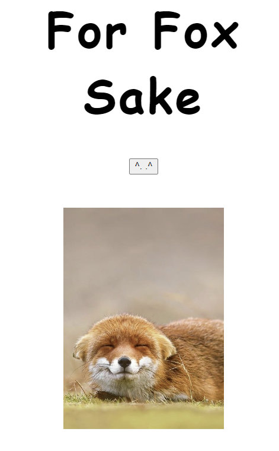

# For Fox Sake
Beware: cute foxes ahead

This is a simple web api with a foxy button as an interface to grab a random fox photo for your enjoyment. 

**Link to project:** [For Fox Sake](https://savvycolleen.github.io/forfoxsake/)

## How It's Made:

**Tech used:** HTML, CSS, JavaScript
The HTML is simple and straightforward. There is a heading with a button, which is used on the client-side to retrieve photos. The CSS is also simple with minimal styling for font and containers. The Javascript uses an event listener and fetch request to retrieve the photo and place it in an image on the DOM. 

## Optimizations
This is a very simple site that could be added upon in many ways: adding design, grabbing more/different info from the database, clearning up the responsiveness, etc. 

## Lessons Learned:

This was made as practice for working with web APIs. I learned how to test APIs and determine what was needed for the fetch request to grab and place the photos in the DOM. This was a fun and quick way for me to check my knowledge and prove to myself that I could use that skill!

